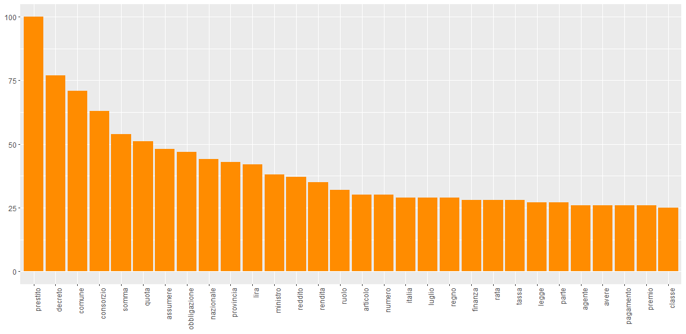
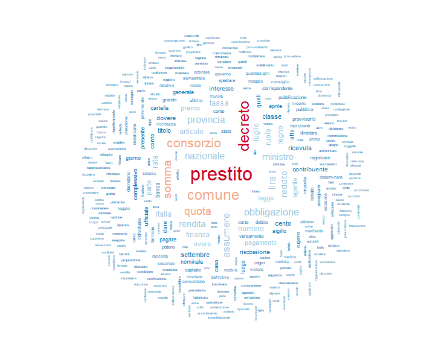
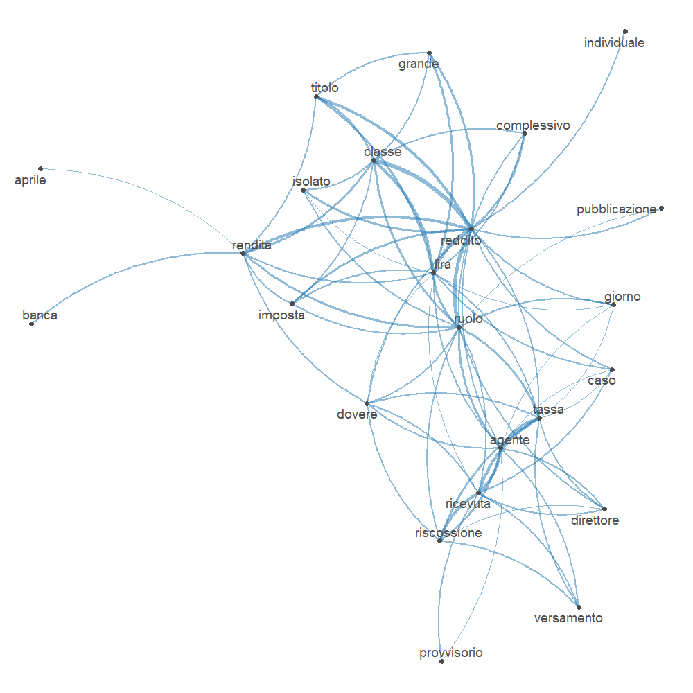
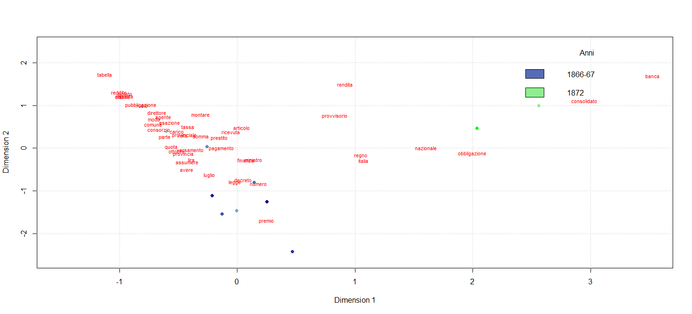
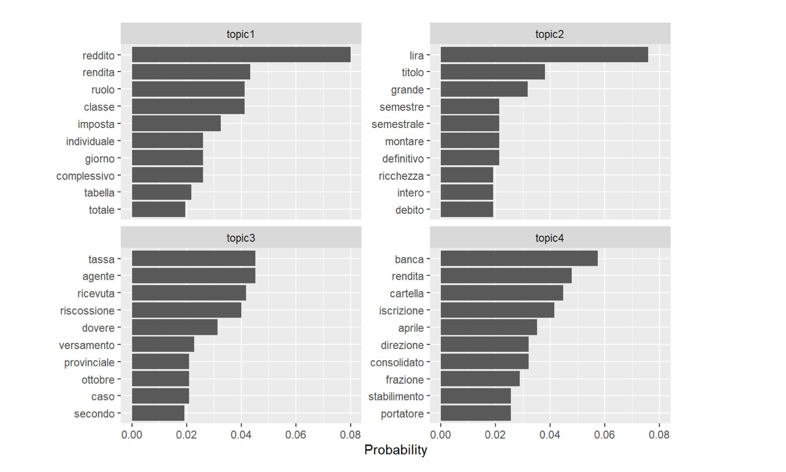

# Le parole dell'economia di guerra

Analisi di text mining sulle normative italiane relative ai prestiti ai cittadini durante e dopo la Terza Guerra d'Indipendenza, con un corpus di decreti e atti emanati tra il 1866 e il 1872.

Il progetto studia come il linguaggio amministrativo e finanziario del nuovo Regno d'Italia racconti le strategie usate per sostenere le spese pubbliche e militari: prestiti nazionali, obbligazioni, imposte, riscossioni e rapporti con la Banca Nazionale del Regno d'Italia.

## Obiettivo

L'analisi mette in evidenza i termini piu ricorrenti, le relazioni tra parole e documenti, e i temi principali che emergono dai testi normativi. Il focus non e soltanto quantitativo: i risultati vengono letti in relazione al contesto storico della costruzione finanziaria dello Stato italiano post-unitario.

## Corpus

Il corpus e composto da 11 documenti normativi in formato RTF, raccolti nella cartella `data/1866-72`. I testi riguardano principalmente decreti regi e ministeriali relativi a prestiti, rendite, imposte, riscossioni e strumenti finanziari.

## Metodo

La pipeline di analisi e implementata in R:

1. importazione dei documenti con `readtext`;
2. lemmatizzazione dei testi in italiano con TreeTagger;
3. controllo ortografico con `hunspell`;
4. costruzione del corpus con `quanteda`;
5. tokenizzazione e rimozione di punteggiatura, numeri, simboli e stopwords;
6. costruzione della document-feature matrix;
7. analisi di frequenza, co-occorrenze, wordcloud, analisi delle corrispondenze e topic modeling.

## Risultati principali

### Vocabolario piu frequente

I lemmi piu ricorrenti mostrano subito il lessico centrale del corpus: `prestito`, `decreto`, `comune`, `lira`, `titolo`, `rendita`, `banca` e altri termini legati al debito pubblico e alla gestione amministrativa.

### Wordcloud

La wordcloud sintetizza visivamente il peso dei termini principali. La centralita di parole come `prestito`, `decreto` e `comune` conferma la natura finanziaria e amministrativa del corpus.

### Rete di co-occorrenza

La rete evidenzia le relazioni tra i lemmi piu frequenti. I collegamenti aiutano a osservare quali concetti compaiono insieme nei decreti, per esempio termini relativi a imposte, rendite, ruoli, riscossioni e istituti bancari.

### Analisi delle corrispondenze

L'analisi delle corrispondenze permette di confrontare i documenti in base al lessico utilizzato. I decreti del 1866-1867 e quelli del 1872 mostrano differenze tematiche: i primi sono piu legati alla richiesta di prestito nazionale e alla ripartizione fiscale, mentre i testi del 1872 si concentrano maggiormente su banca, cartelle, rendita e debito pubblico.

### Topic modeling

Il topic modeling individua quattro gruppi lessicali principali. I primi topic sono associati ai decreti del 1866 sui prestiti, sulle imposte e sulla riscossione; il quarto e piu vicino al decreto ministeriale del 1872, con termini come `banca`, `cartella`, `rendita`, `consolidato` e `portatore`.

## File principali

- `pre-analisi.R`: script principale con importazione, preprocessing, analisi e grafici.
- `ca3d.R`: analisi delle corrispondenze e visualizzazione 3D.
- `Report.qmd`: report Quarto dell'analisi.
- `data/1866-72`: corpus dei documenti normativi.

## Nota sui materiali di presentazione

Il file PowerPoint locale `Presentazione.pptx` non viene pubblicato su GitHub. I contenuti essenziali della presentazione sono invece riassunti in questo README, insieme ai grafici esportati nella cartella `assets`.
